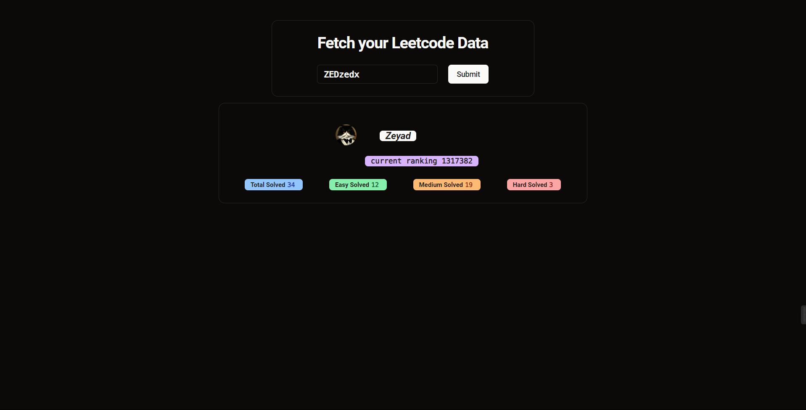

# Simple Leetcode User Data Fetcher


## 🌍Overview

This project allows users to input their Leetcode username and retrieve detailed information about their profile, including key statistics and problem-solving history. It leverages **React**, **TailwindCSS**, and the **shadcn/ui** component library for the frontend, providing a clean and responsive UI. The application also makes use of **React Query** (`useQuery`) to efficiently handle API requests, caching results for a smoother user experience.

## 📸 Preview



## 🚀 Features

- **User Input**: Users can enter their Leetcode username to fetch and display their profile data.
- **Cached API Results**: With the help of `useQuery` from React Query, the application caches API results to optimize network calls and reduce load times for users.
- **Responsive UI**: Built using **TailwindCSS** for fully responsive design across devices.
- **Clean Design**: Leveraging **shadcn/ui** components to maintain a professional, modern look.

## 🏗 ️Stack

- **React**
- **TailwindCSS**
- **shadcn/ui**
- **React Query (`useQuery`)**: For data fetching, caching, and syncing server state with the UI.

## ⚙️ Installation

To set up the project locally:

1. Clone the repository:

   ```bash
   git clone https://github.com/zedoh/Simple-Leetcode-Data-Fetcher
   ```

2. Navigate to the project directory:

   ```bash
   cd Simple-Leetcode-User-Data-Fetcher
   ```

3. Install dependencies:

   ```bash
   npm install
   ```

4. Run the project:

   ```bash
   npm run dev
   ```

## 🤖 Usage

1. Enter your Leetcode username in the input field.
2. Click the **Submit** button to fetch your data.
3. View your profile statistics and problem-solving details on the results page.

## 📜License

This project is licensed under the MIT License.
